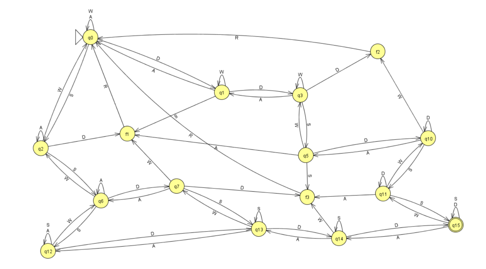
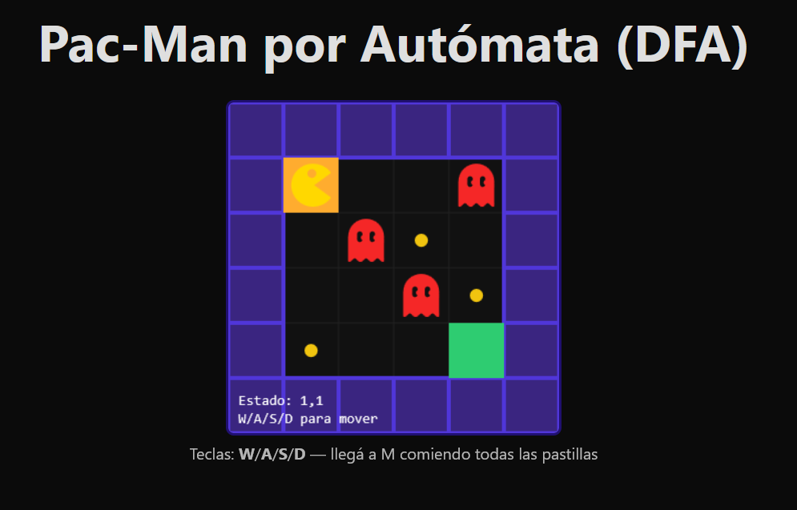
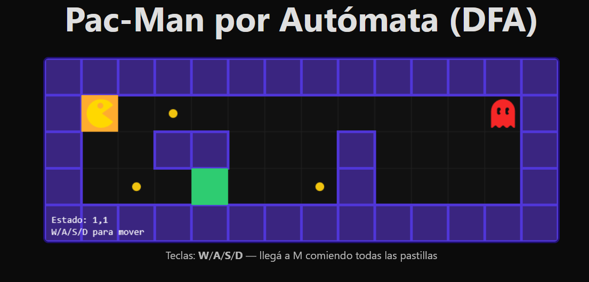
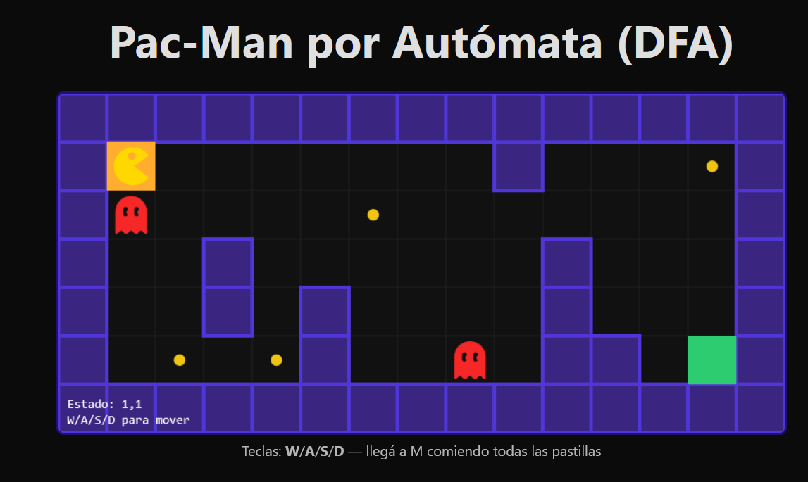
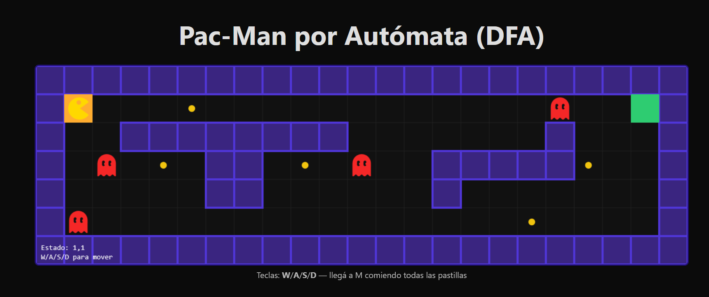

# Proyecto final FTI - Pacman con automatas (AFD)

Se basa en un juego creado con un **automata finito determinista** inspirado en pacman, con el objetivo de comer las pastillas y evitar pasar por los fantasmas hasta llegar a la meta.

## Descripcion

**Herramientas que utilizamos :**

- **Python + automata-lib:** Se utilizo para la construccion del automata a partir del mapa y exportarlo a JSON.

- **React + TypeScript:** Para la capa visual usamos React y TypeScript con Vite, lo que nos permite construir la interfaz y desplegarla fácilmente como aplicación web.

- **Jflap:** Para diseñar el automata, los diferentes estados, transiciones y el alfabeto.

Usamos `automata-lib` en Python para construir el autómata según el mapa y exportarlo a JSON para el front.

El front-end lee el `JSON` exportado, captura los **símbolos de entrada** y aplica las **transiciones de estado**; en paralelo, se controla las pastillas consumidas para declarar victoria al llegar a la meta sin restantes y pasar al siguiente mapa.

Por ultimo se utilizo `GitHub Pages` para el despliegue en forma de sitio web estatico.

## Planteamiento del autómata en JFLAP

**Automata:**
Este proyecto se baso en un automata finito determinista, se planteo en primera instancia en la herrramienta **JFLAP**.

**Alfabeto de entrada**:  
`Σ = { W, A, S, D, R }`  
- `W/A/S/D`: movimiento arriba/izq/abajo/der.  
- `R`: reset (desde MUERTE vuelve a inicio).

*Aclaracion: automata-lib exige que se plantee un automata determinista completo, es decir desde cada nodo se debe poder ingresar todos los simbolos de entrada del alfabeto, por lo que en los estados que no son **MUERTE** unicamente regresa al mismo nodo.*

**Estados**:
- Estados posicionales: cada celda alcanzable del mapa se modela como un estado `(x,y)`.  
- Estado especial **MUERTE**: se entra al pisar un fantasma. 

**Transiciones**:
- Si el movimiento golpea una pared o sale del mapa → se queda en el mismo `(x,y)`.
- Si entra a una celda con fantasma → va a **MUERTE**.
- Si entra a una celda libre → `(x,y) --m--> (x',y')` según el movimiento `m`.
- `R`: desde **MUERTE** → `(x0,y0)` (inicio). Desde cualquier otro estado, `R` no cambia la posición.

**Aceptación**:
- En el autómata cuenta con un estado final, pero la “victoria del juego” se decide en la app cuando además se comieron todas las pastillas (la memoria de pastillas se lleva fuera del autómata).

## Juego

**Primer Mapa**

**Segundo Mapa**

**Tercer Mapa**

**Cuarto Mapa**

*Aclaracion: El primer mapa corresponde al automata planteado en JFLAP.*
## Autores

- [Canario Leonel](https://www.github.com/leonelcnr)
- [Angelo Duarte](https://github.com/dimidio6)
- [Acevedo Daniel](https://github.com/daniace)

